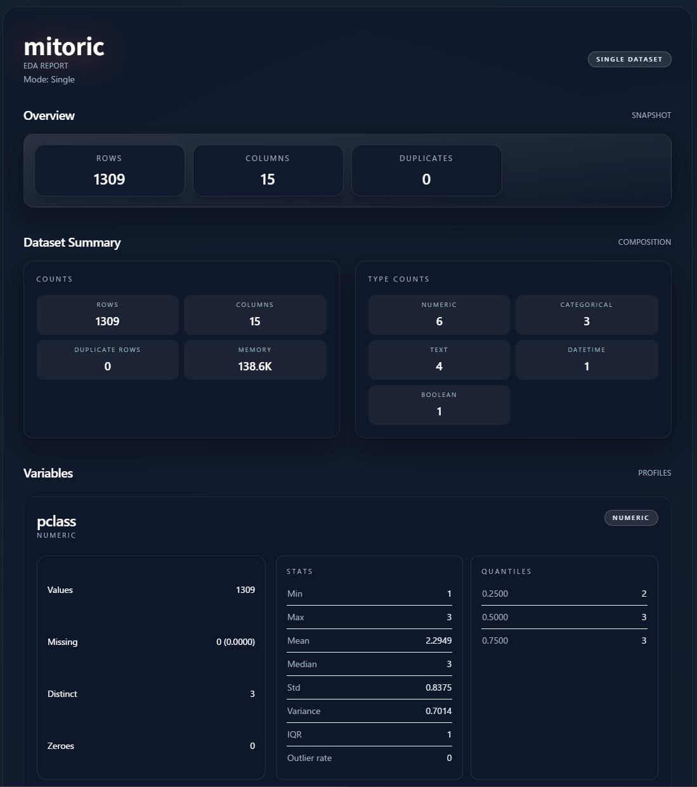

# mitoric

Polars DataFrame 向けの EDA / 比較レポートを単一 HTML として生成するライブラリです。

[PyPI](https://pypi.org/project/mitoric/)

## 特長

- 単一データセットのレポート生成
- 2 データセットの比較レポート生成
- データセット要約（行/列/欠損/重複など）
- カラムプロファイル（数値/カテゴリ/テキスト/日時/ブール）
- 相関/関連の計算
- ヒストグラムのビン数切替（10/15/30/50）

### 要件

- Python 3.10+
- polars>=1
- jinja2>=3.1.6

## 使い方

### 単一データセットのレポート

```python
import polars as pl
from mitoric import generate_single_report

frame = pl.DataFrame(
    {
        "age": [10, 12, 12, 14],
        "city": ["A", "B", "A", "C"],
    }
)

html = generate_single_report(frame, save_path="/tmp/report.html")
print(html[:200])
```

### 2 データセットの比較レポート

```python
import polars as pl
from mitoric import generate_compare_report

left = pl.DataFrame({"value": [1, 2, 3]})
right = pl.DataFrame({"value": [2, 3, 4]})

html = generate_compare_report(
    left,
    right,
    left_name="before",
    right_name="after",
    save_path="/tmp/compare_report.html",
)
```

### 明示的なカラム型の指定

```python
import polars as pl
from mitoric import generate_single_report
from mitoric.models.base import ColumnName, ColumnType, ExplicitType

frame = pl.DataFrame({"flag": ["yes", "no", "yes"]})
explicit_types = [ExplicitType(ColumnName("flag"), ColumnType("categorical"))]

html = generate_single_report(frame, explicit_types=explicit_types)
```

## API

- `generate_single_report(frame, *, target_columns=None, explicit_types=None, save_path=None)`
- `generate_compare_report(left, right, *, target_columns=None, explicit_types=None, save_path=None, left_name=None, right_name=None)`

`explicit_types` で指定できる型: `numeric`, `categorical`, `text`, `datetime`, `boolean`

## 使用例



- [examples/output/single_report.html](examples/output/single_report.html)
- `examples/output/compare_report.html`

## 制約と注意点

- Polars のみサポートしています（Pandas はサポートしていません）
- 出力される HTML は TailwindCSS と chart.js に CDN 経由で依存しています
- `save_path` を指定しない場合は HTML 文字列を返し、保存は行いません

## 免責（言い訳）

このライブラリはバイブコーディングの比率がかなり高いため、不要な処理や意味のない設計、テストが含まれうることをご了承ください。見つけ次第、改善していきます。

## For Developers


### セットアップ

```bash
uv sync
```

### 開発

```bash
uv sync
make lint
make test
make test_e2e # E2Eの出力はリグレッションの確認のためexamples/output/に保存されます
```
